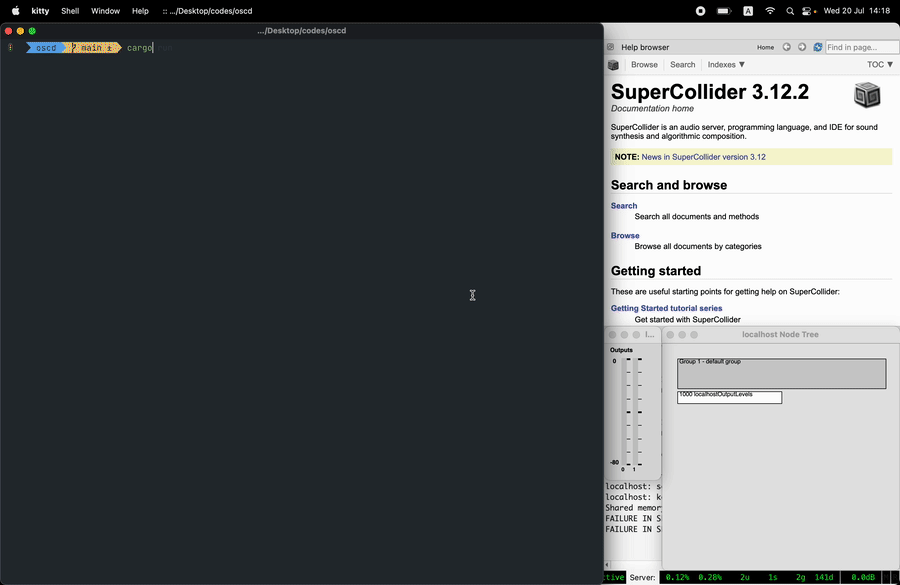

# `oscd`

`oscd`, a simple interactive [OSC](https://en.wikipedia.org/wiki/Open_Sound_Control) debugger for the terminal inspired by [osc-debugger](https://github.com/alexanderwallin/osc-debugger), with auto type casting and support sending multiple osc arguments. 

It has two simple features:

* Monitor OSC messages (over UDP) sent to a port
* Send OSC messages (over UDP) to a port
  - default port = `57110`
  - default address = `127.0.0.1`

## Run
- easiest way is to download [released binary files](https://github.com/karnpapon/oscd/releases), unzip and put it where executable file lives based on your Operating System eg. `usr/local/bin` (for OSX)
- type `oscd` to run program

## Development
- `cargo run` 

## Usage
- Use the following format to send messages: `<address> <argument>`
- `<address>` is osc path to communicate with.
- `<argument>` is a number or a string (double quotes can be omitted) and can have multiple arguments.
- eg. `/s_new "default" -1 0 0 freq 850`, will be parsed as `("s_new", [String("default"), Int(-1), Int(0), Int(0), String("freq"), Int(850)])`)

## Types [WIP]
`oscd` follows [OscType](https://docs.rs/rosc/latest/rosc/enum.OscType.html) from [rosc](https://github.com/klingtnet/rosc) library
- [x] Int(i32)  
- [x] Float(f32)  
- [x] Double(f64)
- [x] String(String)
- [x] Bool(bool)
- [x] Char(char)
- [ ] Blob(Vec<u8>)
- [ ] Time(OscTime)
- [ ] Long(i64)
- [ ] Color(OscColor)
- [ ] Midi(OscMidiMessage)
- [ ] Array(OscArray)
- [ ] Nil
- [ ] Inf

## Building / Release
- binary building with Github Action and supported following architectures
  - aarch64-linux
  - x86_64-linux
  - x86_64-macos
  - x86_64-windows
