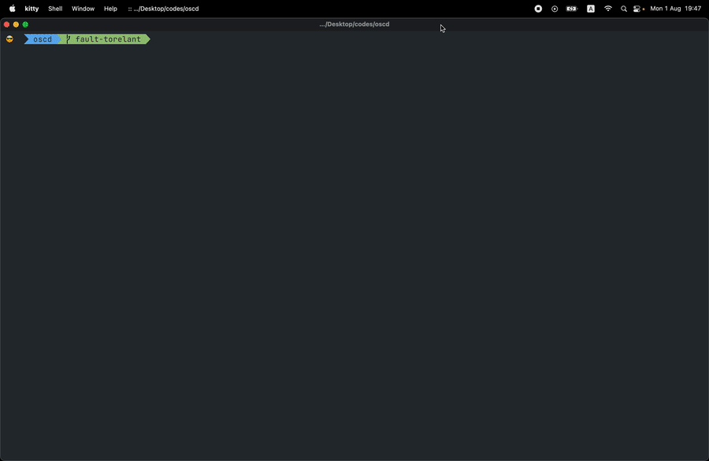

# `oscd`

`oscd`, a simple interactive [OSC](https://en.wikipedia.org/wiki/Open_Sound_Control) debugger for the terminal by using [nom](https://github.com/Geal/nom) as a lexer/parser, `oscd` offers auto type casting and support sending multiple osc arguments. 

It has two simple features:

* Monitor OSC messages (over UDP) sent to a port
* Send OSC messages (over UDP) to a port
  - default port = `57110`
  - default address = `127.0.0.1`

## Install / Run
- easiest way is to download [latest released binary files](https://github.com/karnpapon/oscd/releases), unzip and put it where executable file lives based on your Operating System eg. `usr/local/bin` (for OSX)
- type `oscd` to run program

## Usage
- Use the following format to send messages: `<address> <argument>`
- `<address>` is osc path to communicate with.
- `<argument>` is a number or a string (double quotes can be omitted) and can have multiple arguments.
- eg. `/s_new "default" -1 0 0 "freq" 850`, will be parsed as `("s_new", [String("default"), Int(-1), Int(0), Int(0), String("freq"), Int(850)])`)
- by default `oscd` automatically casting type for you, and it also support [numeric literals type conversion](https://doc.rust-lang.org/rust-by-example/types/cast.html)
  - eg. `65.4321_f64` is equivalent to `65.4321 as f64` (`Explicit conversion`)
  - it will be parsed osc as `Double(65.4321)`, otherwise `osc` will parsed it based on the input (eg. `65.4321` = `f32`).
- see supported types below.
- complete osc example `/s_new "default with whitespace" 1002 'A' 12_i32 12_i64 -12 -12_i32 -12_i64 12.4533 1.234_f64 #2f14DF12 ~7C3a4dAB @12345:23 [12,20,true] %[10,20,30]`

## Types
`oscd` follows [OscType](https://docs.rs/rosc/latest/rosc/enum.OscType.html) from [rosc](https://github.com/klingtnet/rosc) library

| status  | types                | example                            | notes                                                                       |
|---------|----------------------|------------------------------------|-----------------------------------------------------------------------------|
| &#9745; | Int(i32)             | `1234` or `1234_i32`               |                                                                             |
| &#9745; | Long(i64)            | `1234_i64`                         |                                                                             |
| &#9745; | Float(f32)           | `1234.32` or `1234.32_f32`         |                                                                             |
| &#9745; | Double(f64)          | `1234.25434_f64`                   |                                                                             |
| &#9745; | String(String)       | `"str goes here"`                  | wrapped in doulble quotes is needed                                         |
| &#9745; | Bool(bool)           | `true` or `false`                  |                                                                             |
| &#9745; | Char(char)           |  `'S'`                             | wrapped in single quote is needed                                           |
| &#9745; | Blob(Vec&#60;u8>)    | `%[10,20,30]`                      | prefix with `%` separated by `,` number which is not `u8` will be discarded |
| &#9745; | Time(OscTime)        | `@123456789:20`                    | prefix with `@` separate fractional by `:` eg. `@<seconds>:<fractional>`    |
| &#9745; | Color(OscColor)      | `#2F14DF2A`                        | prefix with `#` followed by base16 `#<red><green><blue><alpha>`             |
| &#9745; | Midi(OscMidiMessage) | `~01F14FA4`                        | prefix with `~` followed by base16 `~<port><status><data1><data2>`          |
| &#9745; | Array(OscArray)      | `[10,20,true]`                     |                                                                             |
| &#9745; | Nil                  | `Nil`                              |                                                                             |
| &#9745; | Inf                  | `Inf`                              |                                                                             |

## Development
- `cargo run` 

## Building / Release
- binary building with Github Action and supported following architectures
  - aarch64-linux
  - x86_64-linux
  - x86_64-macos
  - x86_64-windows

## ⚠️ Bypass security settings. (OSX)

With each iteration of OS X from Mountain Lion onwards, Apple have made it progressively harder for users to access un-certificated downloaded applications/binary, such as those coming from the Open Source/Free Software community.

The problem typically manifests when trying to launch a newly downloaded application/binary whether directly or via the Dock. At the point of downloading a new app, the OS places it on a “quarantine list”. An alarming error message is displayed indicating the application is “damaged”, or from an unidentified developer, and has been prevented from running.

A standard workaround for a single application/binary is to launch using “Open” from the menu that pops up using Right-Click (or Ctrl-Click) on the application’s/binary's icon.

## Resources
- https://ccrma.stanford.edu/groups/osc/index.html
- https://ccrma.stanford.edu/groups/osc/spec-1_0.html
- https://ccrma.stanford.edu/groups/osc/files/2009-NIME-OSC-1.1.pdf

## Credit
- inspired by [osc-debugger](https://github.com/alexanderwallin/osc-debugger).